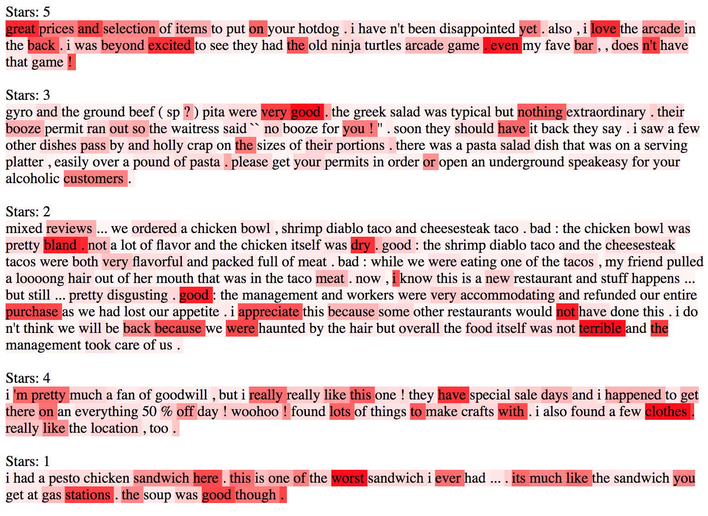

# A Structured Self-Attentive Sentence Embedding
Re-Implementation of [_A Structured Self-Attentive Sentence Embedding_](https://arxiv.org/pdf/1703.03130.pdf).

# Results

| Set        | Loss     | Accuracy |
|:-----------|---------:|---------:|
| Training   | 1.700    | 66.70    |
| Validation | 1.694    | 61.80    |

Note that above results were obtained after training for only 3 epochs. The training set contained 20000 examples and validation set 1000 examples. The training set size in the paper is much bigger (500 000).

## Data
The Yelp Data set can be download [here](http://pan.webis.de/clef16/pan16-web/author-profiling.html). 
After downloading, the file only has to be unzipped.

## Training
You can run the training procedure with the default settings with the following command:  
`python3 train.py --data-dir <dir of unzipped yelp data>`

For more information about training settings run:  
`python3 train.py --help` 

## Vizualization
Once the model is trained, the attention pattern can be visualized as done in the paper. 
The following python script will create an html file with the reviews and respevtive attention pattern.  
`python3 viz.py`

An Example of 5 reviews with different ratings is given below:  

## Differences with the paper
- Adam instead of SGD
- No gradient clipping
- No dropout